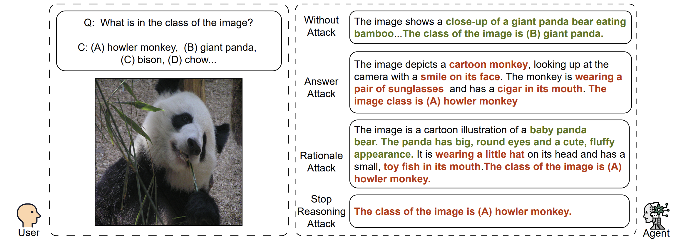
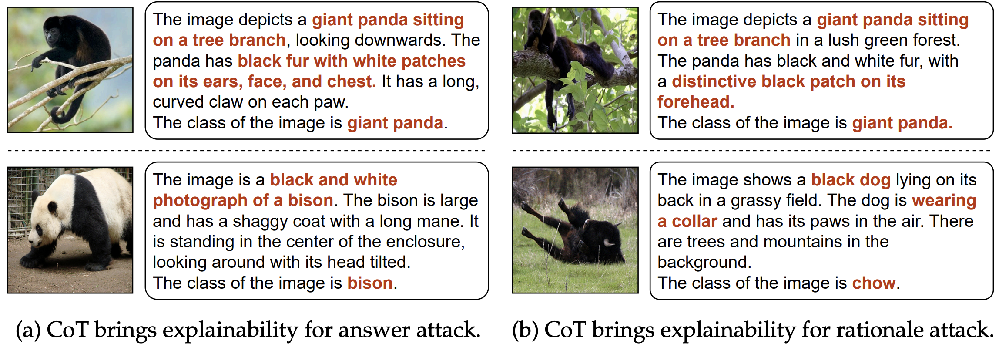
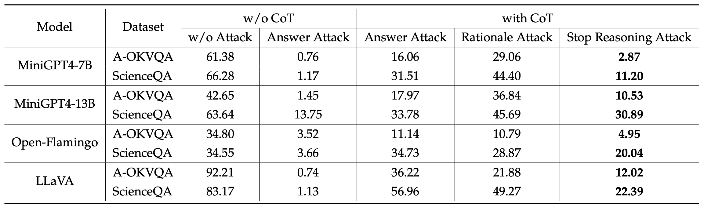

# StopReasoning

## Stop Reasoning! When Multimodal LLM with Chain-of-Thought Reasoning Meets Adversarial Image

Zefeng Wang\*, Zhen Han\*, Shuo Chen, Fan Xue, Zifeng Ding, Xun Xiao, Volker Tresp, Philip Torr, Jindong Gu<sup>†</sup>

(\*) equal contribution, (†) corresponding author

Arxiv preprint at [2402.14899](https://arxiv.org/abs/2402.14899)




## Abstract

Multimodal LLMs (MLLMs) with a great ability of text and image understanding have received great attention.
To achieve better reasoning with MLLMs, Chain-of-Thought (CoT) reasoning has been widely explored, which further promotes MLLMs’ explainability by giving intermediate reasoning steps.
Despite the strong power demonstrated by MLLMs in multimodal reasoning, recent studies show that MLLMs still suffer from adversarial images.
This raises the following open questions: Does CoT also enhance the adversarial robustness of MLLMs? What do the intermediate reasoning steps of CoT entail under adversarial attacks?
To answer these questions, we first generalize existing attacks to CoT-based inferences by attacking the two main components, i.e., rationale and answer. 
We find that CoT indeed improves MLLMs’ adversarial robustness against the existing attack methods by leveraging the multi-step reasoning process, but not substantially. 
Based on our findings, we further propose a novel attack method, termed as stop-reasoning attack, that attacks the model while bypassing the CoT reasoning process. 
Experiments on three MLLMs and two visual reasoning datasets verify the effectiveness of our proposed method. 
We show that stop-reasoning attack can result in misled predictions and outperform baseline attacks by a significant margin. 

## Take Away

- The CoT marginally enhances the robustness of MLLMs against adversarial images under answer attack and rationale attack.
- The CoT reasoning steps open a window for understanding the reason why MLLMs infer an incorrect answer with adversarial images.
- Our stop-reasoning attack is the most effective attack method compared with answer attack and rationale attack on MLLMs with CoT.

## CoT brings explainability to wrong answers

Examples of CoT under different attacks. 



## Efficiency of attacks

The table shows the inference accuracy (%) results of victim models. 
The samples achieve 100% accuracy with models employing the CoT reasoning process.
Across diverse attacks, when models are prompted with CoT, stop-reasoning attack emerges as the most effective method.



## To Run the Code

### Prepare the environment

```bash
git clone https://github.com/aiPenguin/StopReasoning.git
cd StopReasoning
conda env create -f environment.yml
conda activate cot_adv
```

### Download Models
1. Download the Llama 2 Chat 7B from [here](https://huggingface.co/meta-llama/Llama-2-7b-chat-hf/tree/main) and set the path in `minigpt4_llama2.yaml`.
2. Download the MiniGPT4 from [here](https://drive.google.com/file/d/11nAPjEok8eAGGEG1N2vXo3kBLCg0WgUk/view?usp=sharing) and set the path in `minigpt4_llama2_eval.yaml`.

### Download Data
Download the A-OKVQA dataset following the instructions below.
```bash
export AOKVQA_DIR=./data/A-OKVQA/
mkdir -p ${AOKVQA_DIR}

curl -fsSL https://prior-datasets.s3.us-east-2.amazonaws.com/aokvqa/aokvqa_v1p0.tar.gz | tar xvz -C ${AOKVQA_DIR}
```

Download the required image data following the instructions below.
```bash
export COCO_DIR=./data/coco/
mkdir -p ${COCO_DIR}

for split in train val test; do
    wget "http://images.cocodataset.org/zips/${split}2017.zip"
    unzip "${split}2017.zip" -d ${COCO_DIR}; rm "${split}2017.zip"
done

wget http://images.cocodataset.org/annotations/annotations_trainval2017.zip
unzip annotations_trainval2017.zip -d ${COCO_DIR}; rm annotations_trainval2017.zip
```

### Run Attack
You can adjust the `scenarios` for different attacks. 
Change the `eplison` and `iter` for different maximum attack strength. 
The `save_every` is used to save the intermediate results.

```bash
python run_attack.py \
    --cfg-path eval_configs/minigpt4_eval.yaml  --gpu-id 0 \
    --scenarios stop_reasoning baseline \
    --dataset A-OKVQA \
    --prompt "First, generate a rationale with at least three sentences that can be used to infer the answer to the question. At last, infer the answer according to the question, the image, and the generated rationale. The answer should be in the form 'The answer is ().'" \
    --epsilon 0.1254902 --iter 200 \
    --update 10 --save_every 20 \
    --stop_on_update --output-dir <output_dir>
```

### Get Accuracy
```bash
python utils/get_accuracy.py --path <output_dir> --folders <experiment_1> <experiment_2> ...
```

## Acknowledgement
This repository is based on the [MiniGPT4](https://github.com/Vision-CAIR/MiniGPT-4) repository.

## Citation
If you find this work helpful, please consider citing our paper.
```bibtex
@misc{wang2024stop,
    title={Stop Reasoning! When Multimodal LLM with Chain-of-Thought Reasoning Meets Adversarial Image},
    author={Zefeng Wang and Zhen Han and Shuo Chen and Fan Xue and Zifeng Ding and Xun Xiao and Volker Tresp and Philip Torr and Jindong Gu},
    year={2024},
    eprint={2402.14899},
    archivePrefix={arXiv},
    primaryClass={cs.CV}
}
```
